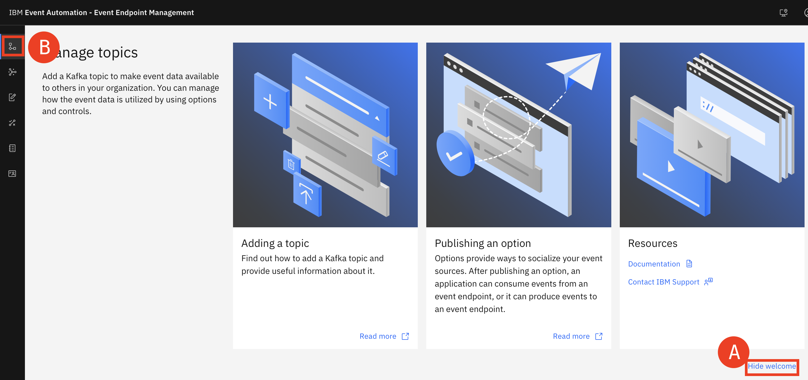
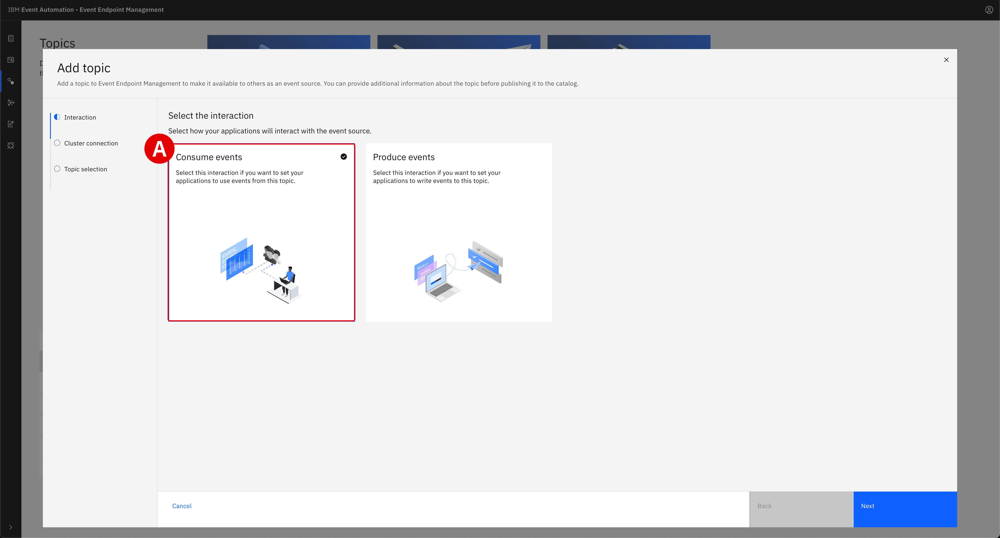
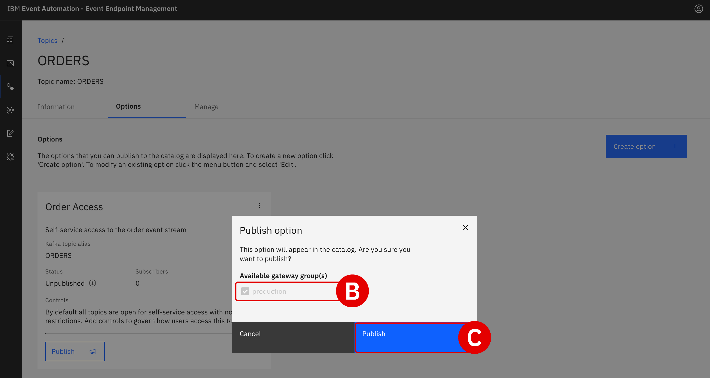
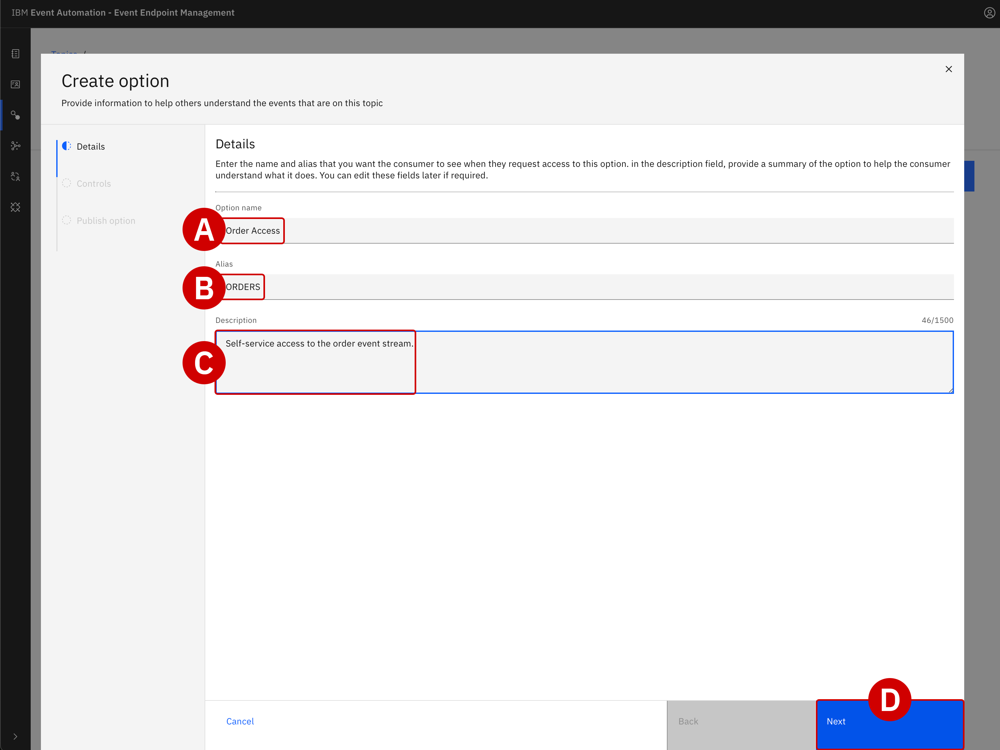
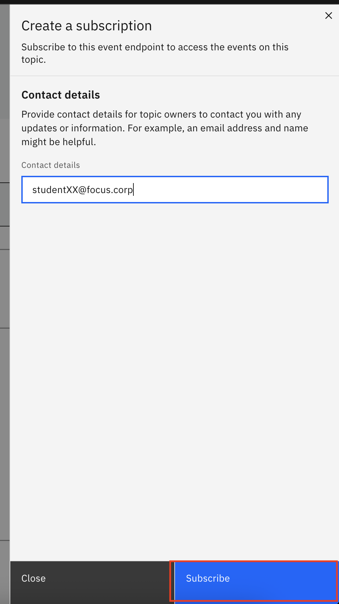

Building a self-service catalog of events with Event Endpoint Management
===

### INDEX

*   [1. Introduction](../index.md)
*   [2. Creating an event stream from MQ data using Event Streams](../1/index.md)
*   [3. Building a self-service catalog of events with Event Endpoint Management](./)
*   [4. Configuring the solution with Event Processing no-code editors](../3/index.md)
*   [5. Connecting real-time events to a promotional marketing app](../4/index.md)

<br>

* * *

Building a self-service event catalog with IBM Event Endpoint Management
========================================================================


Having successfully deployed the IBM MQ-Apacha Kafka connector framework, Focus Corporation's integration team have created a bridge between MQ and Event Streams. As new customer order data is processed by the IBM MQ message queue, it is simultaneously cloned into the `Orders` event stream — awaiting further analysis and action by other users downstream.

In this module, Focus' integration team will utilize **IBM Event Endpoint Management (EEM)** to import the newly-created event stream into a self-service catalog. EEM supports two use cases: the first is allowing teams (like the integration squad) to publish new event streams; the second is for consumers (such as marketing) to browse the contents of those event streams, without requiring direct intervention from the integration team.

<details>
<summary><span style="color:lightblue">WHAT IS THE DIFFERENCE BETWEEN OpenAPI AND AsyncAPI?</span></summary>

<p>OpenAPI and AsyncAPI both represent formalized specifications for describing APIs, but the data source feeding these APIs and the style in which that data is communicated differs between the two. <b>This is important in the context of IBM Event Endpoint Management</b>.</p>

<p> · OpenAPI is designed for describing RESTful API endpoints, focusing on synchronous client-server communication: a client sends a request and waits for a direct response from a server. Therefore, OpenAPI is well-suited for standard web services where a client interacts with a server in a request-response model.</p>

<p> · AsyncAPI is built for working with event-driven, asynchronous APIs that rely on asynchronous communication patterns: publish and subscribe, event streaming, and message-driven APIs. It is well-suited for Internet of Things (IoT) applications, real-time data processing use cases, or other scenarios where communication doesn't follow the typical direct request-response (synchronous and RESTful) API pattern.</p>


<p>Put simply, the key difference between the two is their differing communication patterns. OpenAPI is designed for synchronous messaging (following the request-response pattern) and AsyncAPI is intended for asynchronous communication (event-driven) patterns.</p>

<p>IBM Event Endpoint Management— a composable service within IBM Event Automation —uses AsyncAPI as the standardized way for describing event-driven messages. It allows clients to quickly "discover" events across their ecosystem, publish those events across the organization according to governance rules that ensure compliance, and create enforceable policies through event gateways. Like enterprises do today with API gateways, an event gateway provides isolation, abstraction, policy enforcement, and decoupling to asynchronous (event-driven) data sources.</p>

</details>

<br>

* * *

# Defining new Topics within IBM Event Streams

Before the event stream data can be browsed as part of a self-service catalog, the integration team must first import into EEM the `ORDER` and `CUSTOMER` streams via _Topics_ created earlier within IBM Event Streams.


1.  Since this is the first time that the integration team has needed to import Topics from IBM Event Streams, they must first register the cluster within IBM Event Endpoint Manager (EEM):

    * Openthe EEM UI URL in a new tab within your web browser

    * Click the _Hide Welcome_ text to collapse the tutorials at the top of the page

    * From the left-hand side of the interface, click **Manage Topics** icon


    [](../images/2-1a.png)<br><br><br>


2.  From the right side of the interface, click the blue **Add Topic** button. A configuration tool for importing a Topic into EEM will load.

    *   _Interaction_ settings: Click the **Consume events** and then **Next** to proceed

    *   _Cluster connection_ settings: Click the **Add cluster** button


    [](../images/eem-topic-creation.png)

    [](../images/2-2.png)<br><br><br>


3.  Set the _Cluster Name_ variable to `StudentXX IBM Event Streams` and click **Next** to continue.


    [](../images/2-3.png)<br><br><br>


4.  Additional details about the connection are required: the endpoint address, certificates required for secure communication with the cluster, and authentication credentials.

    *   Set the _Servers_ variable to `es-demo-kafka-bootstrap.tools.svc:9095`

    *   Click **Next** to continue


    [](../images/2-4.png)<br><br><br>


5.  Click (to add a checkmark) on the **Accept all certificates** toggle, then click **Next**.


    [](../images/2-5a.png)

    [](../images/2-5b.png)<br><br><br>


6.  Next, configure details regarding _Credentials_.

    *   The _Security Protocol_ field should remain at the default value of `SCRAM-SHA-512`

    *   _Username_ should be set to `es-admin`

    *   _Password_ must match the **IBM Event Streams** password generated in the Setup module. This password is unique to your particular environment and will be shared by the instructor.

    *   When ready, click **Add Cluster**


    [](../images/2-6.png)<br><br><br>


7.  The web browser will return to the _Add Topic_ configuration page from Step 2.

    *   Under the _Cluster connection_ header, select the `StudentXX IBM Event Streams` connection defined earlier

    *   When ready, click **Next**

    [](../images/2-7.png)<br><br><br>


8.  Now select the Topics that will be made available for browsing within the Event Endpoint Management catalog.

    *   Toggle (select) _both_ the  `CUSTOMERS.NEW` and `STUDENTXX.ORDERS` topics. Depending on the number of topics available in the kafka cluster, you may need to move page forward to find your corresponding `STUDENTXX.ORDERS` topic

    *   Set the alias values to `STUDENTXX.CUSTOMERS` and `STUDENTXX.ORDERS`.

    *   When ready, click **Add Topic**


    [](../images/2-8.png)<br><br><br>


    ---

    ### Defining a data schema for _STUDENTXX.CUSTOMERS_

    With the connections to IBM Event Streams defined and the Kafka Topics selected for replication, Focus' integration team is ready to create self-service event stream catalogs within EEM.

    The team must provide descriptions of the event streams, including an example of how the data is structured and formatted. This description will be beneficial to other individuals within the company (such as the marketing department), who will want to know at-a-glance whether a particular Topic catalog fits their needs.

    ---

9.  From the EEM dashboad, drill down or move page forward button into **Topics** table and to find and click on the name of the `STUDENTXX.CUSTOMERS` topic.


    [](../images/2-9.png)<br><br><br>


10. Click the blue **Edit information** on the right-hand side of the page.


    [](../images/2-10.png)<br><br><br>


11. Within the _Overview information_ tab:

    *   Scroll down until you reach the **Description** field and enter the following text: `Events generated by the customer management system. A new event is created for each new user registration.`

    *   Scroll further down until you reach the **Tags** field and enter `customer`

    *   For the **Contact Email**\[C\] field, enter `studentXX@focus.corp`

    *   Click the **Event Information**\[D\] tab from the left side of the interface

    *   **DO NOT CLICK _SAVE_** — if you _did_ click save, return to the previous screen by clicking the **Edit information** button again


    [](../images/2-11.png)<br><br><br>


12. Within the _Event information_ tab, scroll down until you locate the **Sample message** field. Here you will provide a representation of a typical message on the `STUDENTXX.CUSTOMERS` event stream.

    Copy and paste the following JSON into the **Sample message** field:

    ```json
    {
    "customerid": "acb3eb65-98a1-45c2-84d4-f5df157862b4",
    "customername": "Emilio Quitzon",
    "registered": "2023-10-24 19:20:35.638"
    }
    ```


    When ready, click **Save**\[C\] to finalize both the _Overview Information_ and _Event Information_ configuration settings.


    [](../images/2-12.png)<br><br><br>


13. The web browser will return to the `STUDENTXX.CUSTOMERS` Topic overview.

    *   From the three tabs at the top of the screen, click **Options**

    *   Click the blue **Create Options** button

    [](../images/2-13.png)<br><br><br>


14. Within the _Details_ tab, provide the following customizations:

    *   **Option name**: `StudentXX Customer Access`

    *   **Alias**: `STUDENTXX.CUSTOMERS`

    *   **Description**: `Self-service access to the customer event stream`


    When ready, click **Next**.


    [](../images/2-14.png)<br><br><br>


15. Leave the _Controls_ tab empty (`No data`) and click **Save** to proceed.

    About **Controls**: You can add controls to options so that you have greater management over how event data is processed by the Event Gateway. For instance, you can use the approval control to manage who can subscribe to your event endpoint, the schema filtering control ensures message structure consistency, and redaction hides sensitive data.

    Options can use each of the control types in combination to allow you to manage how events are consumed or produced. More info about available controls can be found here: https://ibm.github.io/event-automation/eem/describe/option-controls/

    [](../images/2-15.png)<br><br><br>


16. The _Publish option_ tab will give you a final opportunity to review the `STUDENTXX.CUSTOMERS` topic before publishing for other users of EEM.

    *   Within the blue _Option Status_ field, click the **Publish** button

    *   Further down the panel, under the _Available gateways_ field, verify that the `egw-group` option is pre-selected.<br/>**Note**: If you see a message in this panel stating that the gateway is not available or pending validation, click ***Cancel***, refresh the browser page (F5), and try again the **Publish** action on the **Option** definition.

    *   When ready, click **Publish**\[C\] to finalize publication of the `STUDENTXX.CUSTOMERS` topic


    [](../images/eem-topic-publish-1.png)

    [](../images/eem-topic-publish-2.png)

    [](../images/2-16c.png)<br><br><br>


    ---

    ### Defining a data schema for _STUDENTXX.ORDERS_

    The process of publishing an event streams Topic within EEM (Steps 9–16) must now be repeated— with some slight modifications —for the `STUDENTXX.ORDERS` topic.

    ---
    <br>

17. From the EEM dashboard, go back to the ** Manage Topic** page and then find ad click the name `STUDENTXX.ORDERS`\[B\].


    [](../images/2-17.png)<br><br><br>


18. Click on the **Edit information** button.

    <br>

19. Within the _Overview information_ tab:

    *   Scroll down until you reach the **Description** field and enter the following text: `Events generated by the customer management system. An event will be emitted for every new order that is made.`

    *   Scroll further down until you reach the **Tags** field and enter `orders`

    *   For the **Contact Email**\[C\] field, enter `studentXX@focus.corp`

    *   Click the **Event Information**\[D\] tab from the left side of the interface

    *   **DO NOT CLICK _SAVE_** — if you _did_ click save, return to the previous screen by clicking the **Edit information** button again


    [](../images/2-19.png)<br><br><br>


20. Within the _Event information_ tab, scroll down until you locate the **Sample message** field. Here you will provide a representation of a typical message on the `STUDENTXX.ORDERS` event stream.

    Copy and paste the following JSON into the field:

    ```json
    {
    "quantity": 9,
    "price": 197.09,
    "customerid": "a7d1586b-ced1-462f-9e44-14e9e5013540",
    "description": "Composite Oversize 28in Tennis Racket",
    "id": "1eba7af9-b748-4754-b750-3459e589dccf",
    "region": "EMEA",
    "ordertime": "2023-10-24 19:26:04.839",
    "customer": "Reed McKenzie DDS"
    }
    ```

    When ready, click **Save** to finalize both the _Overview Information_ and _Event Information_ configuration settings.


    [](../images/2-20.png)<br><br><br>


21. The web browser will return to the `STUDENTXX.ORDERS` Topic overview.

    *   From the three tabs at the top of the screen, click **Options**

    *   Click the blue **Create Options** button


    [](../images/2-21.png)<br><br><br>


22. Within the _Details_ tab, provide the following customizations:

    *   **Order name**: `StudentXX Order Access`

    *   **Alias**: `STUDENTXX.ORDERS`

    *   **Description**: `Self-service access to the order event stream`


    When ready, click **Next**.


    [](../images/2-22.png)<br><br><br>


23. Leave the _Controls_ tab empty (`No data`) and click **Save** to proceed.

    <br>

24. The _Publish option_ tab will give you a final opportunity to review the `STUDENTXX.ORDERS` topic before publishing for other users of EEM.

    *   Within the blue _Option Status_ field, click the **Publish** button

    *   Further down the panel, under the _Available gateways_ field, verify that the `egw-group` option is pre-selected.<br/>**Note**: If you see a message in this panel stating that the gateway is not available or pending validation, click ***Cancel***, refresh the browser page (F5), and try again the **Publish** action on the **Option** definition.

    *   When ready, click **Publish** to finalize publication of the `STUDENTXX.ORDERS` topic


    [](../images/eem-topic-publish-1.png)

    [](../images/eem-topic-publish-2.png)

    [](../images/2-24b.png)<br><br><br>


    ---

    ### Validating the configuration changes and generating access credentials

    Before handing access over to Focus Corporation's marketing team, the integration squad must first validate that the catalogued event streams are performing as expected. If no issues are detected, they can generate access credentials for users to securely access the catalog.

    ---
    <br>


25. Return to the EEM dashboard and drill down into **Catalog** menu\[A\], then locate  and click the name `STUDENTXX.CUSTOMERS` from the table.


    [](../images/2-25.png)<br><br><br>


26. Click the **Subscribe**  button.


    [](../images/2-26.png)<br><br><br>


27. Provide an email address for the _Contact details_ field: `studentXX@focus.corp`

    When ready, click **Subscribe**.


    [](../images/2-27.png)<br><br><br>


28. Access credentials for `STUDENTXX.CUSTOMERS` will be generated immediately and displayed within the web browser.

    *   Record the `Username` and `Password` values to a notepad for reference later

    *   Alternatively, save the credentials as a JSON file (using the **Download as JSON** button) on your local machine  


    <span style="color:orange"> RECORD THE ACCESS CREDENTIALS</span>

    _Don't proceed with the lab guide instructions before recording the `STUDENTXX.CUSTOMERS` access credentials. These values cannot be referenced again once this window is closed. You can always generate new credentials again later, but it will require repeating Steps 25-27._

    [](../images/2-28.png)<br><br><br>


29. Generate access credentials for the `STUDENTXX.ORDERS` catalog in the same way done for `STUDENTXX.CUSTOMERS`:

    *   Return to the EEM dashboard

    *   Drill down into **Catalog** and then click `STUDENTXX.ORDERS`
    <br>   


30. Click the **Generate access credentials** button.
    <br>

31. Provide an email address for the _Contact details_ field: `studentXX@focus.corp`

    When ready, click **Generate**.
    <br>

32. Access credentials for `STUDENTXX.ORDERS` will be generated immediately within the web browser:

    *   Record the `Username` and `Password` values to a notepad for reference later

    *   Alternatively, save the credentials as a JSON file (using the **Download as JSON** button) on your local machine
    <br>

 Thanks to the hard work of the integration squad, the marketing department now has a fully configured, self-service catalog of event stream data available within EEM. At this stage on, responsibility can shift towards Focus Corporation's marketing team. Please note that credentials generation could also be shifted to Focus Corporation's marketing team or other bussiness lines that could be interested in consuming these events by granting them to access the "Catalog" view provided by EEM, so that allowing a even more agile collaboration model

* * *

Next Steps
==========

In the following module, Focus' marketing team will use _IBM Event Processing_ to correlate newly-created customer accounts with orders for a given ammount, within a 24-hour time window.

[Previous: Creating an event stream from MQ data using Event Streams](../1/index.md)  

[Next: Configuring the solution with Event Processing no-code editors](../3/index.md)  

Copyright © 2024 IBM
