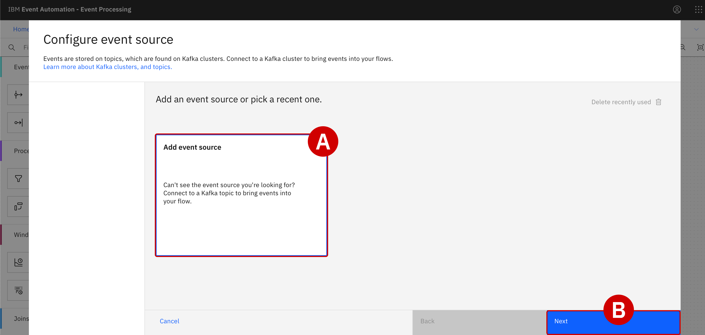
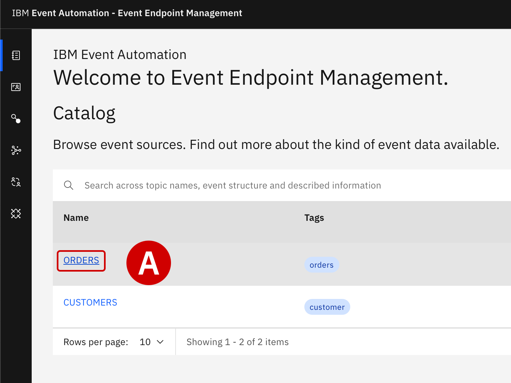
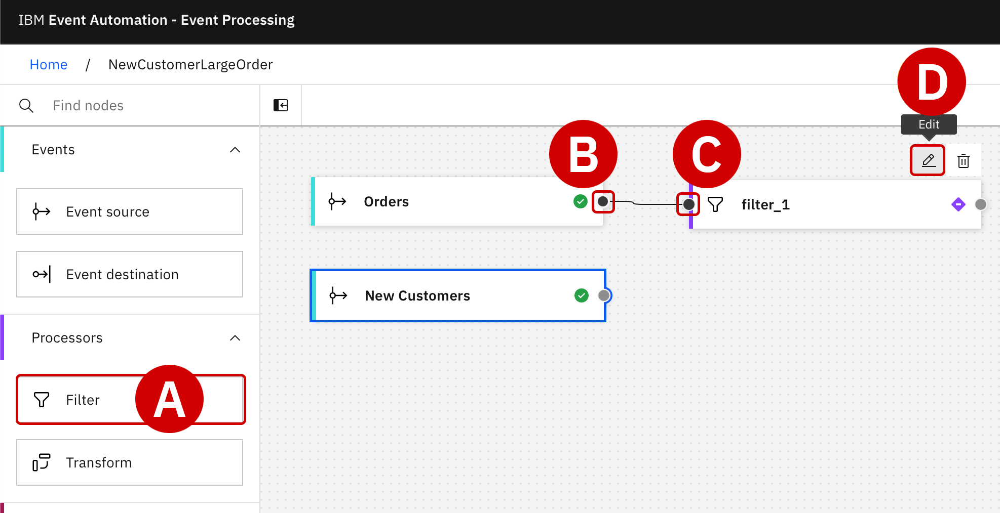
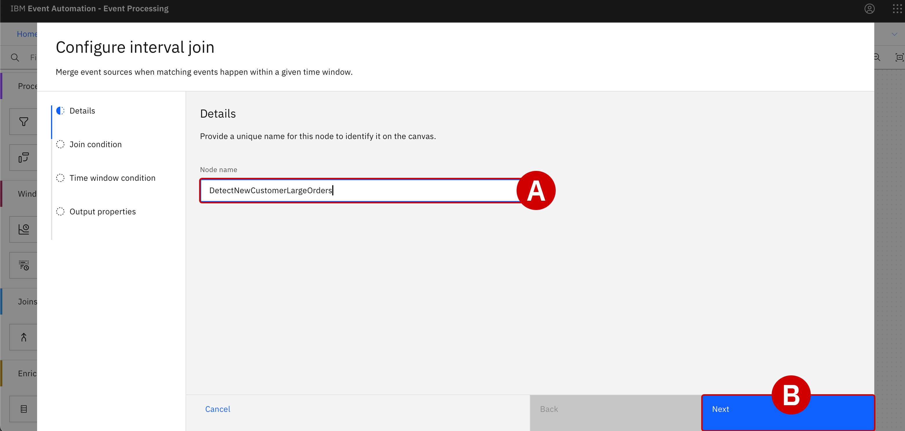
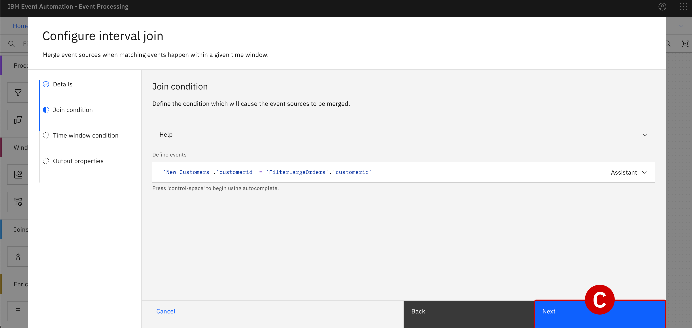
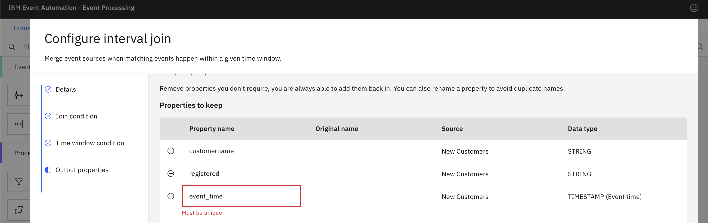

Configuring the solution with Event Processing no-code editors
===

### INDEX

*   [1. Introduction](../index.md)
*   [2. Creating an event stream from MQ data using Event Streams](../1/index.md)
*   [3. Building a self-service catalog of events with Event Endpoint Management](../2/index.md)
*   [4. Configuring the solution with Event Processing no-code editors](./)
*   [5. Connecting real-time events to a promotional marketing app](../4/index.md)

<br>

* * *

Using IBM Event Processing no-code editors to configure the solution
====================================================================


Focus Corporation's marketing department now has a fully configured, self-service catalog of event stream data available within **IBM Event Endpoint Management (EEM)**.

At this stage, work will transition from the integration team to the domain of the marketing team. Focus' marketing team will utilize **IBM Event Processing (EP)** to correlate any newly-created customer accounts with first-time purchase orders that total over **$25** USD in value. Furthermore, these correlated transactions will need to be identified within a 24-hour window of when they occur.

If these conditions can be met, the marketing team will be able to create an actionable plan for putting high-value promotional offers in front of first-time customers in a timely manner — which should translate to more sales revenue through Focus' digital storefront.

* * *

1.  With your web browser, open the **IBM Event Processing** UI URL in a new tab.

    Dismiss any welcome screens or tutorials that are prompted after first logging in by clicking the **Hide Welcome** text in the bottom-left corner of the interface.
    <br>

2.  In the bottom-right corner of the page, click the blue **Create**  to begin defining a new _flow_.  

    <details>
    <summary><span style="color:lightblue">EVENT PROCESSING FLOWS</span></summary>

    <br>
    <p>An event processing flow ingests streams of events, analyzes that input, and takes automatic actions (defined by the user) in response to conditions.</p>

    <p>A flow begins with one or multiple event sources which represent inbound events. For the purposes of this demonstration, you will leverage the STUDENTXX.ORDERS event stream that was defined in the previous module. You will do so using EP's intuitive, no-code authoring canvas.</p>
    <br>
    </details>
    <br>

    

3.  For **Name**  , specify `StudentXXNewCustomerLargeOrder` and then click **Create** .


    [](../images/3-3.png)<br><br><br>


    ---

    ### Configuring an event source for Orders

    Before the inbound events can be captured, connectivity details for the event source node (`STUDENTXX.ORDERS`) must be configured within the authoring canvas.

    ---

4.  Wait until the page has refreshed to display the no-code environment.

    *   Along the left side are tools and actions that can be dragged into the authoring canvas on the right

    *   Within the canvas, you will see an **Event source** node with default name of `source_1`

    *   With your cursor, hover over the `source_1` node and then click the **Edit**  (pencil) icon in the top-right corner of the tile to begin modifying the node


    [](../images/3-4.png)<br><br><br>


5.  The **Configure event source** wizard will load within your browser.

    *   Under the _Add an event source or pick a recent one_ header, select **Add event source**  

    *   Click **Next**


    [](../images/3-5.png)<br><br><br>


6.  Switch back to the **Event Endpoint Management** tab and click **Catalog**.

    *   Drill down into the `STUDENTXX.ORDERS` topic by clicking on the name

    *   Scroll down the topic summary page until you reach the **Selected event endpoint server URLs** section

    *   Copy the _full_ address (`eem-demo-gw-ibm...`) to your notepad for reference later. Please note this server endpoint correspond to the Event Gateway instance ***egw-group***, where the topic ***Option*** was published in the previous lab.

    *   When ready, switch back to the **IBM Event Processing** tab with your web browser


    [](../images/3-6a.png)

    [](../images/3-6b.png)<br><br><br>


7.  Back within EP: the first step, _Cluster Connection_, needs additional information to configure the node.


    *   Paste the full address copied in Step 6 into the **Server** field

    *   Click **Next**

    <br>

8.  The second step, _Access credentials_, requires authentication details for the EEM event source.

    *   Keep the **Select security mechanism** variable as its default value: `PLAIN`

    *   For **Username** and **Password** , supply the credentials for the `STUDENTXX.ORDERS` topic (generated in Step 32 of Lab 2)

    *   Click **Next**


    [](../images/3-9.png)<br><br><br>


9. The third step, _Topic selection_, asks for which topic(s) to ingest from the event source

    *   Available topics will already be displayed within the configuration tool

    *   Under the _Topic selection_ header, click the button next to the `STUDENTXX.ORDERS` topic to select it

    *   Click **Next**


    [](../images/3-10.png)<br><br><br>


10. The fourth step, _Message Format_, will automatically recognize the expected JSON data structure of events ingested from the event source.

    *   _Message format_ may be left as the `JSON` value

    *   Compare the _JSON sample message_ field, ingested from one of the captured Kafka event messages, with the message structure format recorded in the previous module (below)

    *   When ready, click **Next** to proceed


    _Note that this is the same sample schema you supplied when configuring the event source within EEM in Module 2._

    ```json
    {
    "quantity": 9,
    "price": 197.09,
    "customerid": "a7d1586b-ced1-462f-9e44-14e9e5013540",
    "description": "Composite Oversize 28in Tennis Racket",
    "id": "1eba7af9-b748-4754-b750-3459e589dccf",
    "region": "EMEA",
    "ordertime": "2023-10-24 19:26:04.839",
    "customer": "Reed McKenzie DDS"
    }
    ```


    [](../images/event-source-format-1.png)


11. For the next step, _Key and headers_, leave defaults and click **Next**.

12. You will have a final opportunity to review and confirm the event source configuration.

    Go to the **Node name** field and enter `Orders`

    Click **Configure** to finalize the configuration of the `Orders` event source.


    [](../images/3-12.png)<br><br><br>


    ---

    ### Configuring an event source for New Customers

    The configurations performed for the `STUDENTXX.ORDERS` topic (Steps 4 – 12) must now be repeated for the `STUDENTXX.CUSTOMERS` topic.

    ---

13. Return to the `StudentXXNewCustomerLargeOrder` canvas and drag a new **Event Source**  (from the left-hand interface) into the canvas, placing it just below the `Orders` source.

    With your cursor, hover over the new `source_1` node and then click the **Edit** (pencil) icon in the top-right corner of the tile to begin modifying the node.


    [](../images/3-13.png)<br><br><br>


14. The **Configure event source** wizard will load within your browser.

    *   Under the _Add an event source or pick a recent one_ header, select **Add event source**  

    *   Click **Next**


    [](../images/3-14.png)<br><br><br>


15. Switch back to the **Event Endpoint Management** tab and click **Catalog**.

    *   Drill down into the `STUDENTXX.CUSTOMERS` topic by clicking on the name

    *   Scroll down the topic summary page until you reach the **Selected event endpoint server URLs** section

    *   Copy the _full_ address (`eem-demo-gw-ibm...`) to your notepad for reference later.Please note this server endpoint correspond to the Event Gateway instance ***egw-group***, where the topic ***Option*** was published in the previous lab.

    *   When ready, switch back to the **IBM Event Processing** tab with your web browser

    <br>

16. Back within EP: the first tab, _Cluster Connection_, needs additional information to configure the node.

    *   Under the _Connect to Kafka cluster_ header, paste the full address copied in Step 15 into the **Server**  field

    *   Click **Next**


    [](../images/3-16.png)<br><br><br>


17. The second tab, _Access credentials_, requires authentication details for the EEM event source.

    *   Keep the **Select security mechanism** variable as its default value: `PLAIN`

    *   For **Username** and **Password**, supply the credentials for the `STUDENTXX.CUSTOMERS` topic (Step 28 of Module 2)

    *   Click **Next**

    <br>

18. The third tab, _Topic selection_, will ask which topic(s) to ingest from the event source.

    *   Available topics will already be displayed within the configuration tool

    *   Under the _Topic selection_ header, click the button next to the `STUDENTXX.CUSTOMERS` topic to select it

    *   Click **Next**


    [](../images/3-19.png)<br><br><br>


19. The fourth tab, _Message Format_, will automatically recognize the expected JSON data structure of events ingested from the event source.

    *   _Message format_ may be left as the `JSON` value

    *   Compare the _JSON sample message_ field, ingested from one of the captured Kafka event messages, with the message structure format recorded in the previous module (below)

    *   When ready, click **Next** to proceed


    _Note that this is the same sample schema you supplied when configuring the event source within EEM in Module 2_

    ```json
    {
        "customerid": "acb3eb65-98a1-45c2-84d4-f5df157862b4",
        "customername": "Emilio Quitzon",
        "registered": "2023-10-24 19:20:35.638"
    }
    ```


    [](../images/event-source-format-2.png)


20. For the next tab, _Key and headers_, leave defaults and click **Next**.

21. You will have a final opportunity to review and confirm the event source configuration.

    Go to the **Node name** field and enter `New Customers`

    Click **Configure** to finalize the configuration of the `New Customers` event source.


    [](../images/3-21a.png)

    [](../images/3-21b.png)<br><br><br>


    ---

    ### Filtering event sources to match specific criteria

    With the event source fully configured within EP, you can now begin tailoring the event processing flow to filter on orders where the value exceeds **$25** USD.

    ---

22. Scroll down within the list of nodes and actions on the left-side interface until you locate the **Filter** node.

    *   Click and hold the **Filter** node, then drag it to the authoring canvas on the right

    *   Position it to the right side of the `Orders` node

    <br>

23. The output terminal for `Orders` needs to be connected as input to the `filter_1` node.

    *   With your mouse pointer, hover over the `Orders` node and take note of the grey dot (labelled _Output Port_ ) at the right edge of the tile

    *   Click and hold the _Output Port_ (right-most) of `Orders` and **drag** it to the _Input Port_  (left-most edge) of `filter_1`, then release your hold to complete the circuit


    [](../images/3-23.png)<br><br><br>


24. With the `Orders` event source node connected to the `filter_1` operation node, you must utilize the Filter node's expression builder to remove orders that are _less than_ **$25** USD in value. This will allow the marketing team's application to target only first-time customers with spending patterns of **$25** USD or more.

    Hover over the `filter_1` node with your mouse pointer and click the **Edit** (pencil) icon.
    <br>


25. Within the _Details_ tab, specify the value of **Node name** as `FilterLargeOrders`

    When ready, click **Next**.
    <br>

26. The _Define filter_ tab will load next. To the right of the **Filter expression** field, click the **Assistant** drop-down menu to expose additional options.


    [](../images/3-27a.png)<br><br><br>


27. Event Processing's expression builder will guide you in defining the filter.

    *   Property to filter on: `price`

    *   Condition: `Is greater than`

    *   Value: `25`

    *   Click the **Add to expression** button

    *   The expression builder will automatically translate your statements into a syntactically-correct filter statement: `'price' > 25`

    *   Click the **Configure**  button at the bottom of the panel to finalize the filter configuration


    [](../images/3-27b.png)<br><br><br>


    ---

    ### Performing a JOIN across two event sources

    The marketing team needs to "JOIN" the filtered `Order` stream data to records of `New Customers` in order to correctly identify first-time purchasers that placed an order for over **$25** USD in the last 24 hours. Use EP's authoring canvas to carry out the necessary JOIN operation.

    ---

28. Back on the canvas for `StudentXXNewCustomerLargeOrder`, scroll down along the left-hand interface until you locate the **Interval Join** node.

    Drag and drop this node  to the far right-hand edge of the authoring canvas.


    [](../images/3-28.png)<br><br><br>


29. With your cursor, hover over the `New Customers` output terminal and locate the _Output Port_ (grey) button.

    *   Click and hold the `New Customers` _Output Port_ edge and **drag** this to the _Input Port_  edge of the newly-created `intervalJoin_1` node

    *   Release your cursor to finalize the circuit


    [](../images/3-29.png)<br><br><br>


30. Repeat the process, this time connecting the `FilterLargeOrders` node's _Output Port_ to the `intervalJoin_1` node's _Input Port_ .

    At this stage, the input of `intervalJoin_1` should be connected to the outputs of _both_ the `FilterLargeOrders` and `New Customers` nodes.


    [](../images/3-30.png)<br><br><br>


31. The JOIN node must now be configured to correlate events based on a shared `customerid` field within the two event streams (`New Customers` and pre-filtered `Orders`).

    With your cursor, hover over the `intervalJoin_1` node and click the **Edit** (pencil) icon.

    <br>

32. Within the _Details_ tab, set **Node name** equal to `DetectNewCustomerLargeOrders`

    When ready, click **Next** .


    [](../images/3-32.png)<br><br><br>


33. Within the _Join conditions_ tab, activate the expression builder by click the **Assistant** drop-down menu. Set the following properties:

    *   Specify property from 'New Customers': `customerid`

    *   Specify property from 'FilterLargeOrders': `customerid`

    *   When ready, click **Add to expression**

    *   The syntactically-correct JOIN expression will be expressed under the _Define events_ field: `'New Customers'.'customerid' = 'FilterLargeOrders'.'customerid'`

    *   After you have reviewed the JOIN condition, click **Next**


    [](../images/3-33a.png)

    [](../images/3-33b.png)  


    <details>
    <summary><span style="color:lightblue">TRIGGERING EVENTS AND DETECTED EVENTS</span></summary>


    <p>Two concepts are important to understand at this time: Triggering events and Detected events.</p>

    <p> · Since the `New Customer` sign-up event must logically occur before a purchase, it is considered a triggering event</p>

    <p> · Therefore, when a signal for an `Order` purchase of over **$25** (the detected event) is received, the JOIN logic condition will be triggered for the two event streams</p>
    </details>

    <br>

34. Under the _Time window condition_, you can define the time interval "window" where detected events are considered viable for a promotional offer from the marketing team. To meet the criteria, a purchase of over **$25** USD must be made by a first-time customer within a 24 hour window of creating an account.

    *   Look for the **Event to detect** field and select the `FilterLargeOrders (event_time)` option from the drop-down menu

    *   A _Preview_ visualization of the time window interval is rendered within the panel — for now, with no adjustments made, this will appear as a vertical bar at 0 (on the X-axis)

    *   Scroll down further to reveal additional attributes to edit

    *   _Event to set the time window_: `New Customers (event-time)`

    *   _Offset from event to start the time window_: `0` `HOUR(S)`

    *   _Offset from event to end the time window_ : `24` `HOUR(S)`

    *   When ready, click **Next**


    [](../images/3-34.png)<br><br><br>


    ---

    The JOIN node's output will be a combination of fields from both the filtered `Orders` and `New Customers` events streams.

    Before finalizing the interval join, you need to clean up the output so that duplicate fields (like `customerid` and `event_time`) are not included from the JOIN operation. You have the option of renaming or removing the duplicate fields — but for the sake of this demonstration, you will be removing the fields.

    ---

35. Within the _Output properties_ tab, locate the `customerid` field. There are **two** (duplicate) copies of the same field at this time. Your objective will be to delete **ONE** of the two duplicate records, where the _Source_ is labelled as `New Customers`. Preserve the record where _Source_ is labelled as `FilterLargeOrders`.

    *   Click the round `—` sign to the left of the first `customerid` row, where the _Source_ is labelled as "New Customers", to remove the duplicate

    *   The result will be only one copy of the `customerid` field in the table

    *   The red text (_Must be unique_) underlining the field will disappear from the table


    <span style="color:orange"> ONLY REMOVE DUPLICATES WHERE SOURCE == NEW CUSTOMERS</span>

    _When reviewing Output properties for duplicate fields, take note of the table's **Source** column. Duplicates will be produced by both the `New Customers` and `FilterLargeOrders` nodes. Only remove duplicates where the **Source** is listed as `New Customers`._

    [](../images/3-35a.png)<br><br><br>


36. Repeat the procedure for the `event_time` field, which is also duplicated by the JOIN:

    *   Delete the `event_time` row where the _Source_ column is labelled as "New Customers"

    *   With all duplicates removed from the table, the **Configure** button will now be highlighted in blue and selectable

    *   Click the **Configure** button to finalize the interval join configuration


    [](../images/3-36a.png)

    [](../images/3-36b.png)<br><br><br>


* * *

Next Steps
==========

With filtering and processing steps now in place for incoming event streams, Focus Corporation's marketing team is able to detect valid promotional opportunities and emit those detected events to their customer loyalty application. In the following section, you will create those linkages and validate its effectiveness using "live" data feeds.

[Previous: Building a self-service catalog of events with Event Endpoint Management](../2/index.md)  

[Next: Connecting real-time events to a promotional marketing app](../4/index.md)  


Copyright © 2024 IBM
