      Setup - IBM Event Automation for Technical Sales Level 3     :root{--md-text-font:"Roboto";--md-code-font:"Roboto Mono"} \_\_md\_scope=new URL("..",location),\_\_md\_hash=e=>\[...e\].reduce((e,\_)=>(e<<5)-e+\_.charCodeAt(0),0),\_\_md\_get=(e,\_=localStorage,t=\_\_md\_scope)=>JSON.parse(\_.getItem(t.pathname+"."+e)),\_\_md\_set=(e,\_,t=localStorage,a=\_\_md\_scope)=>{try{t.setItem(a.pathname+"."+e,JSON.stringify(\_))}catch(e){}}  html.glightbox-open { overflow: initial; height: 100%; } .gslide-title { margin-top: 0px; user-select: text; } .gslide-desc { color: #666; user-select: text; } .gslide-image img { background: white; } .gscrollbar-fixer { padding-right: 15px; } .gdesc-inner { font-size: 0.75rem; } body\[data-md-color-scheme="slate"\] .gdesc-inner { background: var(--md-default-bg-color);} body\[data-md-color-scheme="slate"\] .gslide-title { color: var(--md-default-fg-color);} body\[data-md-color-scheme="slate"\] .gslide-desc { color: var(--md-default-fg-color);}  

[Skip to content](#prerequisites-and-setup)

IBM Event Automation for Technical Sales Level 3

Setup

Initializing search

IBM Event Automation for Technical Sales Level 3

*   [Introduction](../index.md)
*    [Setup](./)
*   [Evaluation](../evaluation/index.md)
*   [1\. Creating an event stream from MQ data using Event Streams](../1/index.md)
*   [2\. Building a self-service catalog of events with Event Endpoint Management](../2/index.md)
*   [3\. Configuring the solution with Event Processing no-code editors](../3/index.md)
*   [4\. Connecting real-time events to a promotional marketing app](../4index.md/)

Prerequisites and Setup
=======================

* * *

SETUP TIME ESTIMATES

The following section will take approximately **90-120 minutes** to complete. Much of the setup work is fully automated and will allow you to perform other tasks or errands while it is underway. Budget your time accordingly.

SUPPORT AND TROUBLESHOOTING

If you require assistance or run into issues with the hands-on lab, help is available.

*   **Environment issues**: The lab environment is managed by IBM Technology Zone. [Opening a support case ticket](https://techzone.ibm.com/help) is recommended for issues related to the hands-on environment (provisioning, running, and so on.)
    
*   **Documentation issues**: If there is an error in the lab documentation, or if you require additional support in completing the material, open a thread on the [#l3-support-app-modernization](https://ibm.enterprise.slack.com/archives/C06NY5ZGXPY) Slack channel.
    

  

* * *

The hands-on material covered within this lab will focus on _event-led integration_ solutions, specifically the **IBM Event Automation** suite — as well as elements of the **IBM Cloud Pak for Integration** (MQ-Kafka connector.)

IBM Event Automation provides an open, composable set of capabilities that interoperate with the services and tools that are already part of many enterprise IT departments. A fundamental component to IBM Event Automation's architecture is composability, which will be highlighted through the lab as you incrementally add more capabilities and elements to the demo environment.

*   **Event Endpoint Management**: facilitates secured exposure of event streams and unite all event streams (including MQ and Kafka) into a single, comprehensive view. Focus' marketing department can discover, subscribe to, and generate security credentials for colleagues using the self-service catalog. Manual processes will be automated and onboarding of users can be expedited.
    
*   **Event Processing**: a no-code editor for allowing developers (of any skill level) to construct processing flows, detect situations across multiple events inside a configurable time-window, and validate flow behavior prior to deploying into production (using historical data.)
    
*   **Event Streams** + **Kafka-MQ connector**: part of the _IBM Cloud Pak for Integration_ suite, this connector allows _IBM MQ_ messages to be published into a Kafka-compatible event stream. It provides assurances that all MQ messages are delivered once-and-only-once, without requiring complex or custom code.
    

Environment templates (images) have been defined ahead of time with the assistance of **IBM Technology Zone** (ITZ), which can be reserved for learning and client demonstration purposes at no-charge. Some further configuration of these environments will be required after deployment.

* * *

Request an IBM Technology Zone Environment
==========================================

You will require access to the ITZ in order to reserve your environment and complete the lab. If you do not yet have access or an account with the ITZ, [you will need to register for one](https://techzone.ibm.com/).

The hands-on environment— a combination of services from _IBM Cloud Pak for Integration_ (CPI) and _IBM Event Automation_ (EA) —will be running entirely atop of **Red Hat OpenShift**, which will orchestrate containerized deployments of CPI and EA across the OpenShift cluster.

* * *

1.  **Reserve** a Red Hat OpenShift cluster via the IBM Technology Zone pre-defined template.
    
    **URL:** **[https://techzone.ibm.com/my/reservations/create/63a3a25a3a4689001740dbb3](https://techzone.ibm.com/my/reservations/create/63a3a25a3a4689001740dbb3)**
    

* * *

2.  From the `Single environment reservation options` list, select **Reserve now**\[A\].
    
      
    [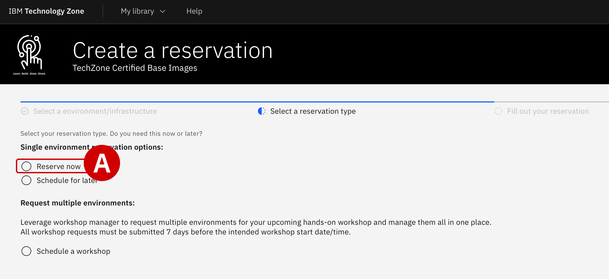](../images/setup-2.png)
    

* * *

3.  Supply additional details about your ITZ reservation request:
    
    *   **Name**\[A\]: Give your reservation a unique name.
        
    *   **Purpose**\[B\]: Set to `Practice / Self-Education` and affirm that customer data will not be used with the environment. If you are replicating this hands-on demonstration with a client, you must select _Customer Demo_ and supply a sales opportunity number.
        
    *   **Purpose Description**\[C\]: Provide a brief summary of how the environment will be used.
        
    *   **Preferred Geography**\[D\]: Select the data center region that is closest to your location.
        
    *   **End Date & Time**\[E\]: Select a time and date for when the reservation will expire. The recommended amount is 2 days, although it is possible to finish the hands-on demonstration within a few hours. Additional time extensions are available.
        
    *   **OCP/Kubernetes Cluster Network**\[F\]: Default value of `10.128.0.0/14`
        
    *   **Enable FIPS Security**: Default value of `No`
        
    *   **OpenShift Version**\[G\]: Set to `4.14`
        
    *   **Storage**\[H\]: Set to `ODF - 2 TB`
        
    *   **OCP/Kubernetes Service Network**\[I\]: Default value of `172.30.0.0/16`
        
    *   **Worker Node Count**: Default value of `3`
        
    *   **Worker Node Flavor**\[J\]: Set to `16 vCPU x 64 GB - 100 GB ephemeral storage`
        
    
    When satisfied, verify that you agree to the _Terms and Conditions_ for the environment and finalize your reservation request by clicking **Submit**\[K\].
    
    PROVISIONING TIMES
    
    Reservations take approximately **60 minutes** to complete from the time that you click submit. If you navigate to the **[My Reservations](https://techzone.ibm.com/my/reservations)** tab of the ITZ, you can monitor the progress of your reservation. Wait for the ITZ reservation to be marked as "_Ready_" before attempting to start the lab — accessing it too soon will lead to issues (or an outright failure) when connecting to the OpenShift cluster.
    
    [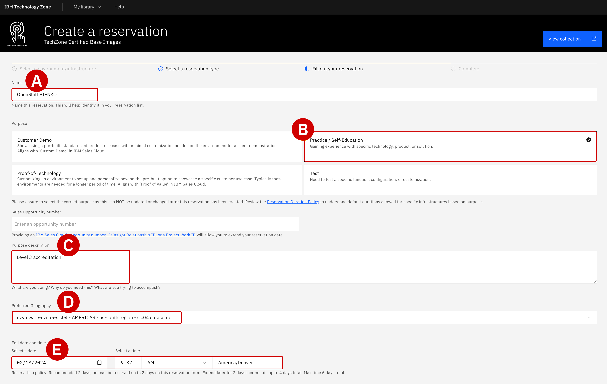](../images/setup-3a.png)
    
    [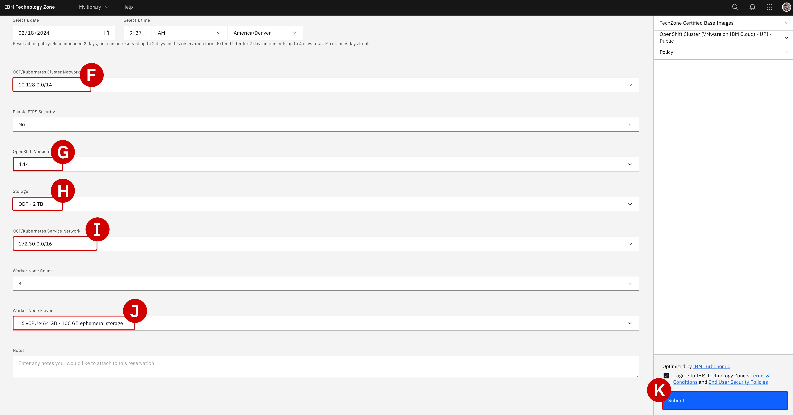](../images/setup-3b.png)
    

* * *

4.  When the ITZ environment is ready to go, you will receive an email to your inbox (similar to the screenshot below). Click the blue **View My Reservations**\[A\] at the bottom of the email to open a page with more details about the environment. Alternatively, you can click the [My Reservations](https://techzone.ibm.com/my/reservations) tab from the ITZ home page to drill down into your environment's details.
    
      
    [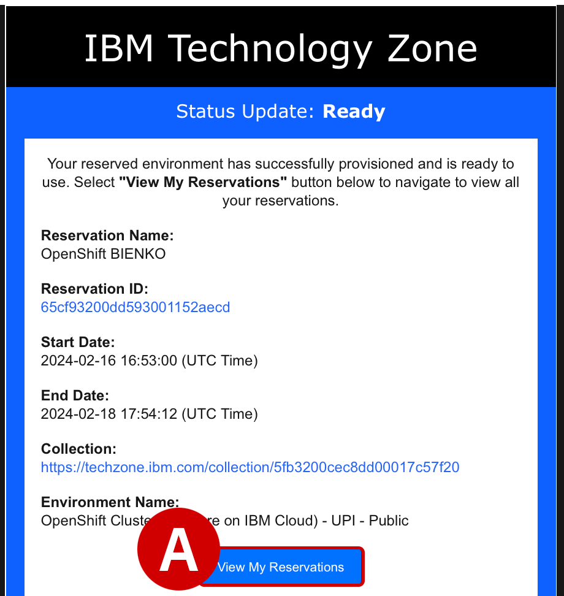](../images/setup-4.png)
    

* * *

5.  Details about your OpenShift cluster, including login and authentication details, are summarized on the page.
    
    *   Record the **Username**\[A\] (`kubeadmin`) and **Password**\[B\] (unique to your environment), as well as the **Desktop URL** just above those two items, to a notepad for reference later
        
    *   Click **Open your IBM Cloud environment**\[C\] to access OpenShift's dashboard
        
    
      
    [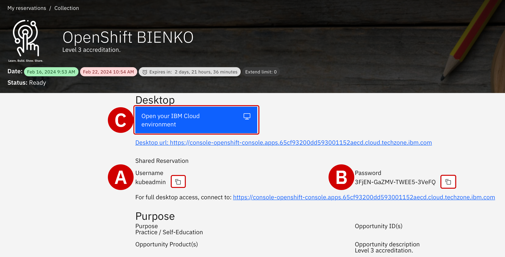](../images/setup-5.png)
    

* * *

6.  You will be prompted to provide the **Username** and **Password** recorded in Step 5.
    
    *   Click **Log in**\[A\] to proceed
        
    *   Once authenticated, the web browser will redirect to the main dashboard for the OpenShift Container Platform web interface
        
    *   You are now ready to proceed with the lab environment customization for _IBM Event Automation_ and _IBM Cloud Pak for Integration_
        
    
      
    
    THIS CONNECTION IS NOT PRIVATE
    
    Depending on your web browser, you may receive a warning about `This connection is not private` or a similarly phrased message. Disregard these warnings and continue to the intended destination by clicking _"visit this website."_
    
    [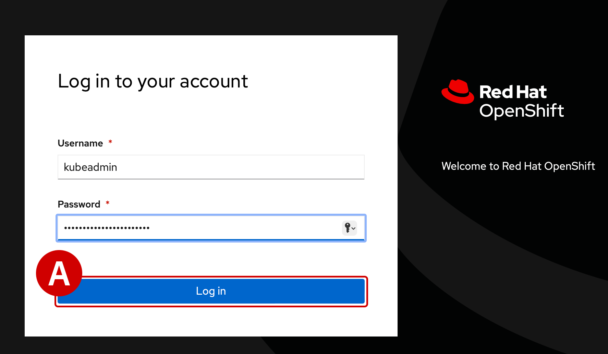](../images/setup-6.png)
    

* * *

Customization of the Lab Environment
====================================

7.  In order to deploy containerized instances of _IBM Event Automation_ and _IBM Cloud Pak for Integration_ on top of OpenShift, you must first download and set up your local machine with the **OpenShift Command Line Interface (CLI)**.
    
    *   In the top-right corner of the OpenShift dashboard, click the **question mark**\[A\] (`?`) icon as shown in the screenshot below
        
    *   Click the **Command line tools**\[B\] option from the drop-down menu
        
    
      
    
    COMMAND LINE ACCESS
    
    For parts of the hands-on lab, you will be required to establish connections over SSH to remote infrastructure endpoints. It is recommended that users do so via **Terminal** (Mac) or **PuTTY** (Windows). For detailed instructions on how to connect with PuTTY, or if you are using Windows, [reference the linked material](https://ibm.box.com/s/d71tn63hutdxrjwh21qdzralrsxlcspe).
    
    [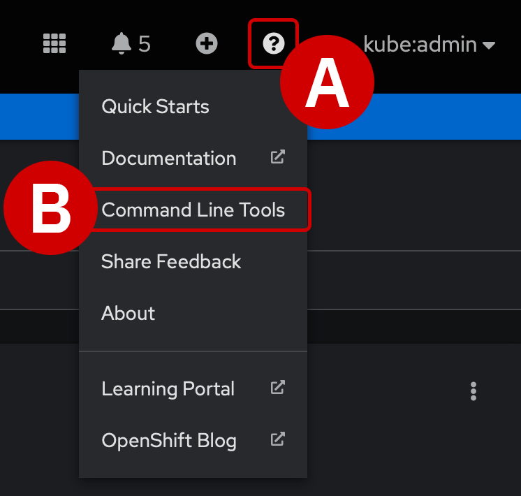](../images/setup-7.png)
    

* * *

8.  From the _oc - OpenShift Command Line Interface (CLI)_ options, click the download link that matches your local machine's operating system (Mac, Windows, or Linux). Once downloaded, execute the installer and proceed with the lab guide once `oc` is installed.

* * *

9.  Return to the OpenShift dashboard landing page.
    
    *   In the far right-hand corner of the interface, click the **kube:admin** button to open another drop-down menu
        
    *   From the options, select **Copy login command**\[A\] to open a new tab or window with details about remotely accessing the OpenShift cluster
        
    
      
    [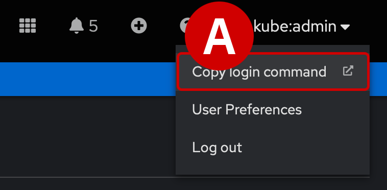](../images/setup-9.png)
    

* * *

10.  A mostly-blank page will load, with **Display Token** written in blue text in the top-left of the page. Click the link to proceed.

* * *

11.  Details about a newly-generated API token will load on screen.
    
    Record the full command listed under **Log in with this token**\[A\] (resembling something similar to `oc login --token=sha256...`) and save this to your notepad for later reference.
    
      
    [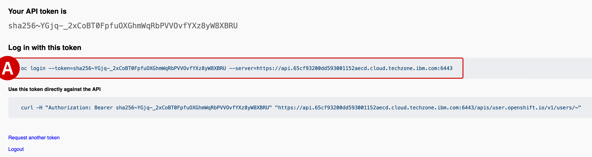](../images/setup-11.png)
    

* * *

12.  Open your command line tool of preference on your local machine, likely either **Terminal** or **PuTTY**. At this stage, the OpenShift CLI (`oc`) should be available on your machine and ready for remotely connecting to the OpenShift cluster.
    
    *   Within the Terminal, **paste the full login command** recorded in Step 11 and hit `Return` to commence the login
        
    *   A prompt similar to the screenshot below will be displayed momentarily, indicating that the Terminal is now successfully connected (remotely) to the OpenShift cluster
        
    
      
    [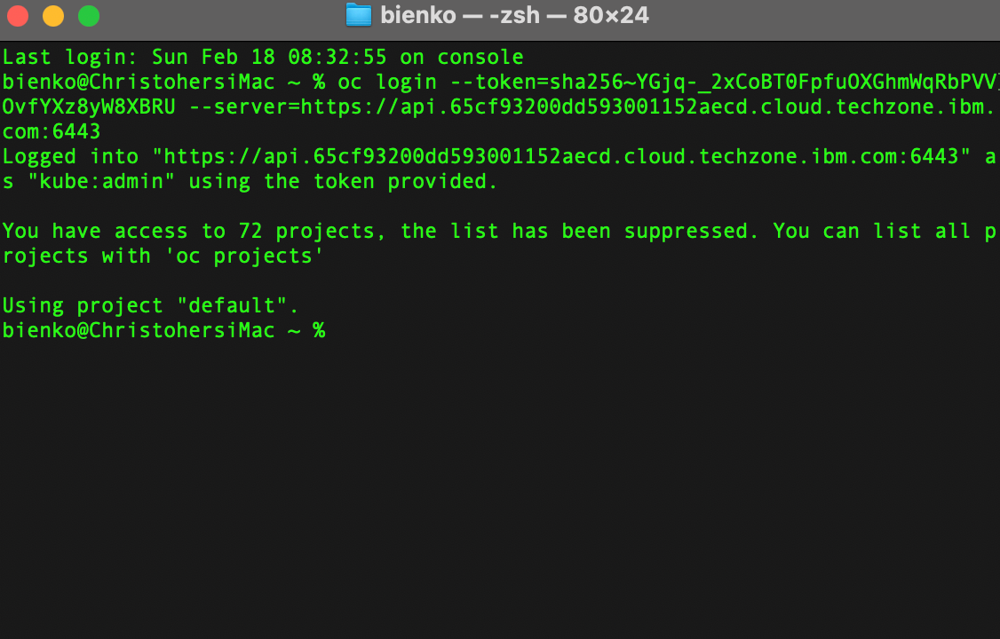](../images/setup-12.png)
    

* * *

13.  To deploy containerized instances of _IBM Event Automation_ and _IBM Cloud Pak for Integration_ to the OpenShift cluster, you must first download those container images _locally_ and then deploy them _remotely_ on the OpenShift cluster.
    
    **Execute** the following command within your Terminal console to `clone` the necessary scripts and images to your _local machine_:
    
    **Copy and execute:**
    
    `git clone https://github.com/IBM/platinum-demo-code-event-automation.git`
    

* * *

14.  Navigate to the newly cloned `platinum-demo-code-event-automation` repository with the following command:

`cd platinum-demo-code-event-automation`

* * *

WINDOWS USERS

_Step 15_ uses a shell script to deploy _IBM Cloud Pak for Integration_ and _IBM Event Automation_ via OpenShift containers. The shell script can be executed as-written for MacOS and Linux users.

However, if you are a Windows user, follow **[the linked documentation](https://ibm-integration.github.io/learninghub/demos/cp4i-api-tech/win-user/)** to request a Linux Virtual Machine. You will only need to make use of the VM for the purposes of _Step 15_ (deploying the demo environment.) Afterwards you may carry on with the lab instructions on your personal Windows device via a web browser.

15.  Execute the following command to kick off the process of deploying and configuring the containerized services to the _OpenShift cluster_:

`./deploy.sh`

*   Wait for the full deployment to complete before continuing with the lab documentation
    
*   When ready, each of the lab services— IBM Cloud Pak for Integration\[A\] ("Platform Navigator"), Event Streams\[B\], Event Endpoint Management\[C\], Event Processing\[D\], and IBM MQ\[E\] —will be listed to the Terminal window
    
*   Each listing will be accompanied by a `URL`, `username`, and `password` — **record** this information to a notepad for reference later
    
      
    
    DEPLOYMENT TIMES
    
    The deployment of _IBM Event Automation_ and _IBM Cloud Pak for Integration_ containers to the OpenShift cluster is entirely automated using _Red Hat Ansible_ scripts. Full deployment and configuration should take approximately **20-45 minutes** to complete.
    
    [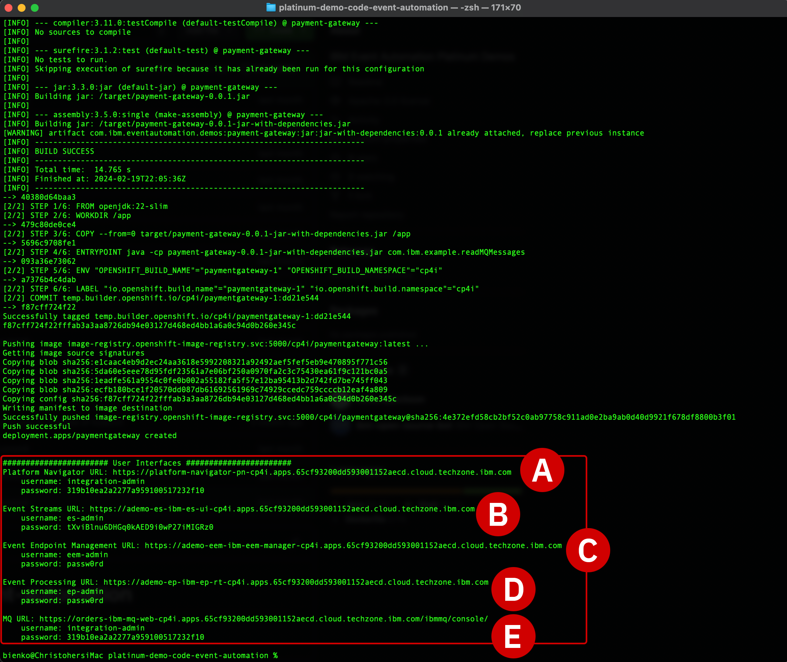](../images/setup-15.png)
    

* * *

16.  The _Platform Navigator_ and _IBM MQ_ services utilize the same login details. The password supplied for these two services by the Terminal console in Step 15 is a _temporary_, _one-time-use_ password.
    
    *   Try logging into the _IBM MQ_ environment environment by pasting the `URL` into a web browser, then enter the `username` and temporary `password` recorded earlier
        
    *   When prompted, create your own password for logging into the environment
        
    *   Confirm your selection with **Submit**\[A\] and then update your `password` records for both the _Platform Navigator_ and _IBM MQ_ services
        
    *   At this stage, the lab environment is fully configured and ready for hands-on work
        
    
      
    [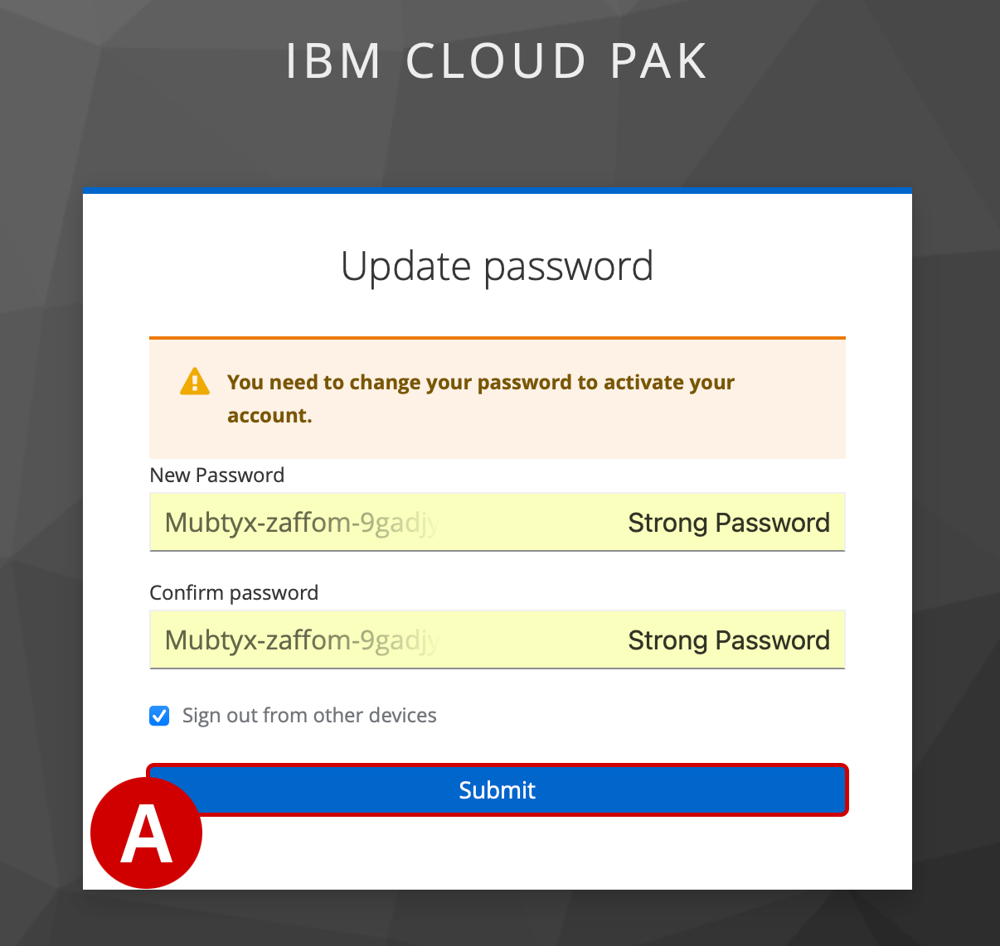](../images/setup-16.png)
    

* * *

MQ & CPI AUTHENTICATION

Both services utilize the same `username` and `password` credentials. However, the two URLs generated by the Terminal console in Step 15 are _unique_. Ensure that you are logging in to the correct dashboard (IBM MQ or CPI) when asked to do so.

17.  With your web browser, open a new tab for each of the services needed for the hands-on lab:
    
    *   _IBM Cloud Pak for Integration (CPI)_
    *   _Event Streams_
    *   _Event Endpoint Management_
    *   _Event Processing_
    *   _IBM MQ_

  
Keep these tabs open. You will be switching between them frequently.

* * *

Next Steps
==========

The following module will outline the Level 3 evaluation criteria for IBM technical sellers and business partners. Follow the accreditation steps appropriate to your job role.

[

Previous Introduction

](..)[

Next Evaluation

](../evaluation/)

Copyright © 2024 IBM

Made with [Material for MkDocs](https://squidfunk.github.io/mkdocs-material/)

{"base": "..", "features": \["navigation.instant", "navigation.tracking", "content.code.annotate"\], "search": "../assets/javascripts/workers/search.ecf98df9.min.js", "translations": {"clipboard.copied": "Copied to clipboard", "clipboard.copy": "Copy to clipboard", "search.config.lang": "en", "search.config.pipeline": "trimmer, stopWordFilter", "search.config.separator": "\[\\\\s\\\\-\]+", "search.placeholder": "Search", "search.result.more.one": "1 more on this page", "search.result.more.other": "# more on this page", "search.result.none": "No matching documents", "search.result.one": "1 matching document", "search.result.other": "# matching documents", "search.result.placeholder": "Type to start searching", "search.result.term.missing": "Missing", "select.version.title": "Select version"}} document$.subscribe(() => {const lightbox = GLightbox({"touchNavigation": true, "loop": false, "zoomable": true, "draggable": true, "openEffect": "zoom", "closeEffect": "zoom", "slideEffect": "slide"});})